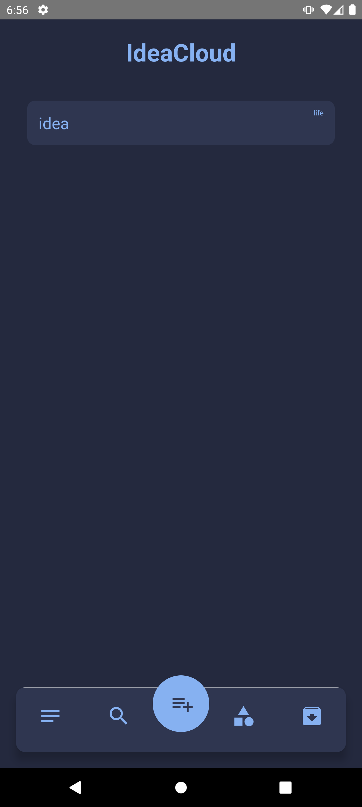
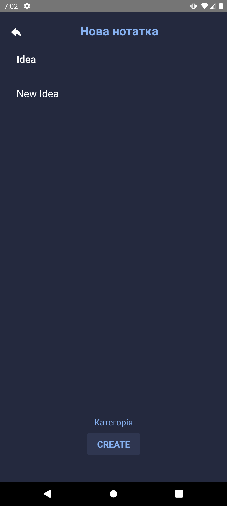
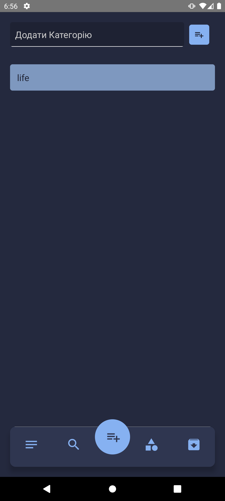

# IdeaCloud 💡

IdeaCloud is a simple and intuitive mobile app to store and organize your ideas. Designed to help you keep track of your creative thoughts, categorize them, and find them easily using search functionality.

## 🧩 Features

- 💡 Add new ideas with multiple fields.
- 🔍 Search functionality to quickly find your ideas.
- 📂 Categorize your ideas for better organization.
- 🗄️ Archive – save old or completed ideas for future reference.

This app does not rely on Expo. It's built entirely with **React Native CLI**.

## 📸 Screenshots

| Home                                   | Add Idea                             | Category                                         |
| -------------------------------------- | ------------------------------------ | ------------------------------------------------ |
|  |  |  |

---

## ⚙️ Tech Stack

- **React Native CLI** – core framework for building the app.
- **SQLite** – for secure local data storage.
- **React Navigation** – for navigation and bottom tabs.
- **AsyncStorage** – for storing preferences.
- **Vector Icons** – for sleek visual experience.

---

## 🛠️ Setup Instructions

### Clone the repository

```
git clone https://github.com/VilenSolovey/IdeaCloud.git
cd VaultKeeper
```

### Install dependencies

`npm install`

### For iOS

`cd ios && pod install && cd ..`

### Start the app

#### For Android

`npx react-native run-android`

#### For iOS

`npx react-native run-ios`

## Feel free to reach out for questions or suggestions.
